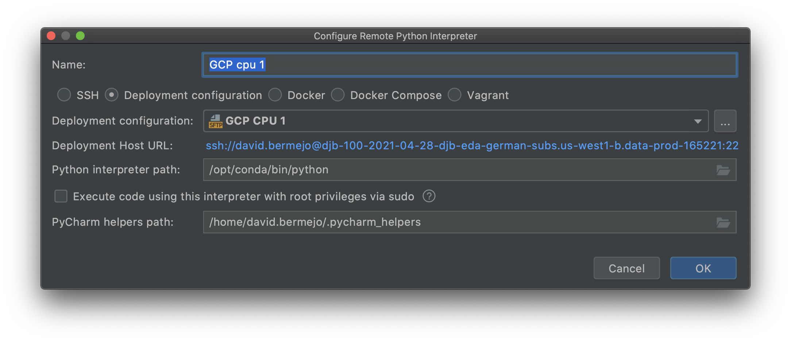

subclu - SUBreddit CLUstering / Topic Modeling for i18n
==============================
[For more details, please see the 1-pager](https://docs.google.com/document/d/1MXE7SKnXJMVUE93IKuR2WvL8RgHpjmFISkMylXNdUjY/).

We want to create topic clusters/models to better understand the content of German-relevant subs so that we can use them to
- a) inform strategy for content creation (and maybe SEO as well?)
- b) improve discovery (use the post & subreddit topic scores as inputs to One Feed).

At the end of each iteration of this project we should have 
1. A set of topics (we'll need to create human-interpretable labels)
2. A topic assigned to each post/comment
3. A score for how common each topic is in each subreddit that is geo-relevant to Germany

For example, we should be able to say that in that past week in subreddit X:
- 80% of posts are about topic A
- 15% of posts are about topic B
- 5% are about other topics

# GCP Notebooks ssh setup
### Create a GCP Notebook
For this project I'm using GCP notebooks for R&D because they offer self-service scalability & ssh connections that make it easy to integrate with PyCharm for local development & github integration.

Here's the dashboard to access GCP instances/notebooks:
https://console.cloud.google.com/ai-platform/notebooks/list/instances?project=data-prod-165221

For v0/v1 we'll be using FastText and a CPU instance is good enough.


### Set up gcloud tools in your laptop (if you haven't set it up)
In order to authenticate & connect to a GCP notebook, we need to use the `gcloud` SDK. For the latest instructions see here: https://cloud.google.com/sdk/docs/install
- Download the installer for your OS
  - Example: for intel Mac laptops (non M1) download `macOS 64-bit (x86_64)`
- Move & unzip the file in your home directory
- Run this command to install the sdk: `./google-cloud-sdk/install.sh`
- (Optional) Delete the zipped package

### Run authentication SDK & set default project name
After gcloud sdk is installed, run this command to create authentication tokens:
<br>`gcloud auth login`

Set the default project with this command:
<br>`gcloud config set project data-prod-165221`

### Create SSH keys & refresh GCP tokens
`gcloud compute config-ssh`

This command will refresh authentication tokens & checks which virtual machines are available for you. You'll need to run it every ~8 or ~12 hours. [The documentation isn't clear on timing](https://cloud.google.com/sdk/gcloud/reference/compute/config-ssh).

The first time you run the command, it'll also create a new set of SSH keys. Note that you'll be asked to create a passphrase for additional security.

### Connect to instance from command line
Once you have the keys & tokens refreshed, you can connect to your instance using regular ssh, like this:
<br>`ssh <notebook-name>.<notebook-region>.<project-name>`

For example:
<br>`ssh djb-100-2021-04-28-djb-eda-german-subs.us-west1-b.data-prod-165221`

### What is home?
When you ssh, you will only have write access to your personal folder. When you ssh, your home will be:
<br>`/home/<gcp-user>`

In my case, it is:
<br>`/home/david.bermejo`

NOTE: When you are logged in via the JupyterLab GUI (HTTPS server), your home directory for JupyterLab will be:
<br>`/home/jupyter`

# PyCharm Setup
### Add SSH connection to PyCharm
The notes below are a summary of Pycharm's detailed guides here:
<br>https://www.jetbrains.com/help/pycharm/create-ssh-configurations.html

- Open the Settings/Preferences dialog (`⌘,`)
- Go to **Tools > SSH Configurations**.
- Fill out the Host, User name, & other information to look like the screenshot below.
    - Host should be the same as what you use to connect via the command line, e.g., `djb-100-2021-04-28-djb-eda-german-subs.us-west1-b.data-prod-165221`
- For **Authentication type** select `Key pair`
  - Note that `gcloud` will create the **Private key file** in: `~/.ssh/google_compute_engine`
  - Save the passphrase so that PyCharm can automatically upload without asking for it on each sync 


### Add remote interpreter to PyCharm
The notes below are a summary of Pycharm's detailed guides here:
<br>https://www.jetbrains.com/help/pycharm/configuring-remote-interpreters-via-ssh.html#ssh
- Python interpreter path:
<br>`opt/conda/bin/python`




### Add deployment configuration (remote syncing)
After you've set an ssh connection & an intepreter, you can connect to the same host to sync changes between the two locations. You can find most of these options under the `deployment` menu:
<br>https://www.jetbrains.com/help/pycharm/creating-a-remote-server-configuration.html

- When you use SSH, you should select the `SFTP` type.
- Set **Root path** to `/`
  - PyCharm uses relative paths later on that can be confusing
- For mappings, make sure to map local repo to remote repo location
- Exclude `/data` subfolder unless needed


Other options: I prefer to sync only saved files, but you can change as you like.
- Go to: **Tools > Deployment > Options**


# Install our module in `editable` mode
Editable makes it easy to continue editing your module and use the updated code without having to re-install it. This can speed up development when you pair it with jupyter's magic to automatically refresh edited code without having to re-import the package.

To install the repo as a package as `--editable` in GCP, first assume sudo for your gcp user. Then install the code from where you stored the code synced to PyCharm.
<br>`sudo su - david.bermejo`
<br>`pip install -e /home/david.bermejo/repos/subreddit_clustering_i18n/`

In jupyter, you can add this magic at the beginning of a notebook to reload edited code:
```
%load_ext autoreload
%autoreload 2
```

# Clone repo to JupyterLab. Use: create & edit notebooks
## Create new SSH key
Follow github's guide to create an SSH key & add it to your agent.
- https://docs.github.com/en/github/authenticating-to-github/generating-a-new-ssh-key-and-adding-it-to-the-ssh-agent

## Add SSH key to ssh-agent
After creating the key you'll need to 1) start the ssh-agent, 2) add your key to ssh-agent:

`eval "$(ssh-agent -s)"`

`ssh-add ~/.ssh/id_ed25519`

Note: you'll be prompted for your git passphrase.

## Clone repo to JupyterLab
The default method to clone uses HTTPS, but Reddit requires ssh authentication. So you need to open a terminal and clone it like so:
`git clone git@github.snooguts.net:david-bermejo/subreddit_clustering_i18n.git`

Note: it can be a bit confusing, but the version of the library we install won't be the same one that runs jupyter notebooks

Here's what the JupyterLab file explorer should look like after cloning the repo


Project Organization (Cookiecutter)
------------

    ├── LICENSE
    ├── Makefile           <- Makefile with commands like `make data` or `make train`
    ├── README.md          <- The top-level README for developers using this project.
    ├── data
    │   ├── _00_external       <- Data from third party sources.
    │   ├── _01_raw            <- The original, immutable data dump.
    │   ├── _02_interim        <- Intermediate data that has been transformed.
    │   ├── _03_processed      <- The final, canonical data sets for modeling.
    │   └── embeddings         <- NLP embeddings used to convert posts & comments into vectors.
    │
    ├── docs               <- A default Sphinx project; see sphinx-doc.org for details
    │
    ├── models             <- Trained and serialized models, model predictions, or model summaries
    │
    ├── notebooks          <- Jupyter notebooks. Naming convention is a number (for ordering),
    │                         date notebook/analysis started, 
    │                         the creator's initials, and a short `-` delimited description, e.g.
    │                         `1.00-2021-04-21-jqp-initial_data_exploration.ipynb`.
    │
    ├── references         <- Data dictionaries, manuals, and all other explanatory materials.
    │
    ├── reports            <- Generated analysis as HTML, PDF, LaTeX, etc.
    │   └── figures        <- Generated graphics and figures to be used in reporting
    │
    ├── requirements.txt   <- The requirements file for reproducing the analysis environment, e.g.
    │                         generated with `pip freeze > requirements.txt`
    │
    ├── setup.py           <- makes project pip installable (pip install -e .) so src can be imported
    ├── subclu             <- Source code for use in this project.
    │   ├── __init__.py    <- Makes src a Python module
    │   │
    │   ├── data           <- Scripts to download or generate data
    │   │   └── make_dataset.py
    │   │
    │   ├── features       <- Scripts to turn raw data into features for modeling
    │   │   └── build_features.py
    │   │
    │   ├── models         <- Scripts to train models and then use trained models to make
    │   │   │                 predictions
    │   │   ├── predict_model.py
    │   │   └── train_model.py
    │   │
    │   └── visualization  <- Scripts to create exploratory and results oriented visualizations
    │       └── visualize.py
    │
    └── tox.ini            <- tox file with settings for running tox; see tox.readthedocs.io


--------

<p><small>Project based on the <a target="_blank" href="https://drivendata.github.io/cookiecutter-data-science/">cookiecutter data science project template</a>. #cookiecutterdatascience</small></p>
