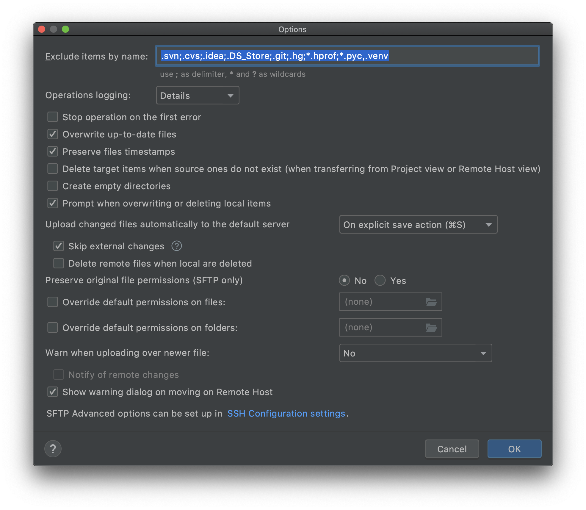
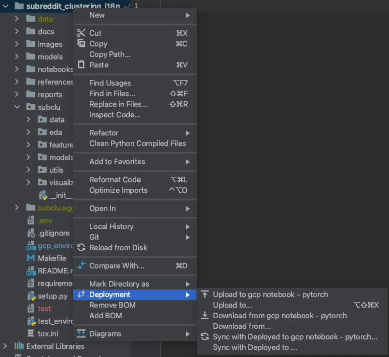

After you've gone through the setup instructions in [gcp_environment_setup.md](gcp_environment_setup.md), this README/doc is a reference guide for common processes and configurations with a focus on subclu (the i18n clustering project).

# View existing notebooks / Consoles & URL Proxy
After you've created a notebook VM, you should be able to see it in one of the following consoles:

#### Consoles:
VM instances in `data-prod` project:
- https://console.cloud.google.com/compute/instances?project=data-prod-165221

GCP AI notebooks in `data-science` project:
- https://console.cloud.google.com/ai-platform/notebooks/list/instances?project=data-science-prod-218515

GCP spark clusters on `data-science` project:
- https://console.cloud.google.com/dataproc/clusters?region=us-central1&project=data-science-prod-218515


#### Individual VMs:
Inference for USE (GPU):
- project: data-prod
- Use for getting embeddings (vectorizing text)
- https://7958aa9a2f5e63c6-dot-us-west1.notebooks.googleusercontent.com/lab

CPU / EDA:
- project: data-prod
- Use for Dask cluster, bump to 64 CPUs & 400+ GB RAM)
- Use for regular EDA: (32 CPUs & ~64 GB RAM)
- https://1185e8680f9b40ca-dot-us-west1.notebooks.googleusercontent.com/lab?


# Jupyterlab settings
For jupyterlab configuration, see:
[jupyterlab_configuration.md](references/jupyterlab_configuration.md)


# Sync an existing GCP notebook VM
Before running a new job on a VM, use this checklist to make sure that the VM has the latest:
- mlruns database (latest experiments data from mlflow)
- code (and github branch)

## 0. Refresh gcloud auth on your laptop
Here's how to refresh your GCP tokens
```bash
gcloud compute config-ssh
# You should now be able to use ssh/scp with your instances.
# For example, try running:
#
#  $ ssh djb-100-2021-04-28-djb-eda-german-subs.us-west1-b.data-prod-165221
```

#### _[OPTIONAL/debug tip]_ gcloud auth login
After gcloud sdk is installed, run this command to create authentication tokens. Note that you might need to run this command if you haven't used the gcloud CLI in a while (a few weeks?).
```bash
gcloud auth login
```
#### _[OPTIONAL/debug tip]_ Change `active` project to the project linked to your VM
You need to set the `active` project to the project that your VM belongs to, otherwise you won't be able to ssh into the VM.

You can list all your configurations with this command:
```bash
gcloud config configurations list

# NAME                 IS_ACTIVE  ACCOUNT                   PROJECT                   COMPUTE_DEFAULT_ZONE  COMPUTE_DEFAULT_REGION
# datascience-project  True       david.bermejo@reddit.com  data-science-prod-218515
# default              False      david.bermejo@reddit.com  data-prod-165221
```

Change your active configuration with:
```bash
gcloud config configurations activate default
```

### Change your VM type
Sometimes you can't edit a VM in the console, but you can edit in it through the CLI. CLI documentation
- https://cloud.google.com/compute/docs/instances/changing-machine-type-of-stopped-instance#gcloud
- https://cloud.google.com/sdk/gcloud/reference/compute/instances/set-machine-type

For example, you can change your machine type (change CPU count & memory/RAM).
Here's a list of machine types:
- https://cloud.google.com/compute/docs/machine-types
- https://cloud.google.com/compute/docs/general-purpose-machines
```bash
# General purpose:
n1-highmem-96   |  96 vCPUs |  624 GB Memory

# Memory-optimized:
m1-highmem-96   |  96 vCPUs | 1433 GB Memory

m1-ultramem-80  |  80 vCPUs | 1922 GB Memory
m1-ultramem-160 | 160 vCPUs | 3844 GB Memory
```

Example commands
```bash
# 0. Make sure the VM is stopped!
gcloud compute instances stop VM_NAME

# 1. Change the machine type:
gcloud compute instances set-machine-type djb-100-2021-04-28-djb-eda-german-subs \
  --machine-type=m1-megamem-96
```


### SSH into Jupyter Lab [optional/debug]
For some reason, the URLs to connect to a VM can sometimes break (you get a 403 error). If that's the case, you can use SSH to create a tunnel to the VM and connect "locally" to the VM. This is the same method used to connect to the MLflow server below.
<br>See the shell fxn named `dj_ssh_jupyterlab` so it's easy to switch between multiple VMs.

Example:
```shell
ssh -N -L 8081:localhost:8080 djb-subclu-inference-tf-2-3-20210630.us-west1-b.data-prod-165221
```
Then you can connect to the VM at this address:<br>
http://127.0.0.1:8081/lab?

## 1. Sync mlflow database manually
- Check which `sqlite` database has the latest info (largest size & latest updates) & copy to all subfolders
  - Mlflow DB root: `subreddit_clustering_i18n/mlflow_sync`
  - mlflow subfolders (each host gets its own database file, which I manually copy to all folders)
    - `djb-100-2021-04-28-djb-eda-german-subs`
    - `djb-subclu-inference-tf-2-3-20210630`
    - `manually_merged`
    
- Push changes to desired git branch
```bash
git add .
git commit -m "<Update mlflow DB>"
git push
```

## 2. Update VM's settings & start the VM
If needed, change the VM's vCPU or memory. Check your VM in one of the consoles:

`data-prod` project, VM instances:
- https://console.cloud.google.com/compute/instances?project=data-prod-165221

`data-science` project, Notebook instances:
- https://console.cloud.google.com/ai-platform/notebooks/list/instances?project=data-science-prod-218515

Once you start the VM, go to the VM's proxy URL to access the jupyterlab UI. Common URLs:
- Notebook with GPU for mUSE inference (vectorizing posts & comments):
  - https://7958aa9a2f5e63c6-dot-us-west1.notebooks.googleusercontent.com/lab
- Notebook for EDA, clustering, and aggregation: 
  - https://1185e8680f9b40ca-dot-us-west1.notebooks.googleusercontent.com/lab?

## 2. Sync github repo for `jupyter` user
The default user in the notebook GUI is `jupyter`, so we need to sync the code in the VM with the latest code.

- Go to the jupyterlab UI 
- Start a console session
- 1) Start the ssh-agent
- 2) Add the ssh-key you registered with github to the ssh-agent
  - This way we can use git commands to push, pull, etc. without having to add our password after each command
```bash
eval "$(ssh-agent -s)"

ssh-add ~/.ssh/id_ed25519
```
Note: you'll be prompted for your git-ssh passphrase.

- Change directory to the repo
```bash
cd subreddit_clustering_i18n
```

- Check if there are any uncommited changes & pull latest changes in origin/remote repo
```bash
git status
git pull
```


- _[OPTIONAL]_ commit & push changes as needed
```bash
git add .
# ...

git commit -m "<Commit message>"
git push
```

- change branch, if needed
```bash
# list branches
git branch -a 

# Check out a new branch
git checkout <branch_name>
git pull
```

## 3. Set VM as "deployment"/remote for PyCharm
We need to set as active "deployment" VM so that whenever we write and save code on PyCharm it automagically uploads it to our VM. You can find most of these options under the `deployment` menu:
<br>https://www.jetbrains.com/help/pycharm/creating-a-remote-server-configuration.html

- Settings ( `⌘` + `,`) > `Deployment` 
- Move the VM's config to "Active deployment" group
- Change options to sync only saved files:
  - Go to: **`Tools` > `Deployment` > `Options`**



## 4. Remove old code, push new code & install module in `editable` mode under `david.bermejo` user  
In the VM we'll actually install and sync our module under your personal user (e.g., `david.bermejo`). So we also need to synchronize our code here. 


### Remove old code (delete old code)
- Start (or continue) a terminal session in jupyterlab.
- First, we'll need to assume a new user (`david.bermejo`)
- Then we remove all the old code -- it's easier/better to start from scratch because we don't have a good way to sync the code for this user (this remote directory is NOT a github repo, but it is synced to our laptop).

```bash
sudo su - david.bermejo

rm -r repos/subreddit_clustering_i18n
```

### Push new code to remote directory
In PyCharm, we can select and upload only the folders/files that are core for modeling.

- Select the core folders/files (`cmd` + click on each):
  - `subclu/`
  - `Makefile`
  - `requirements.txt`
  - `requirements_laptop.txt`
  - `setup.py`
  - `test_environment.py`

- `Right click` on the selected files
- Select: \> `Deployment` > `Upload to <deployment>`

(The screenshot shows upload options when selecting the project root, but that can take a long time when uploading notebooks and other folders that are not needed to install the module.)



### Install fresh code as `editable` library
_NOTE_: See more detailed instructions on `editable mode` in the [gcp_environment_setup.md](gcp_environment_setup.md) document.

```bash
# Continue in previous console where we already assumed the user identity, or open a new one
# sudo su - david.bermejo

# Each VM might have slightly different uses & requirements, so it's best
#  to install the specific VM's requirements using [extras]

# EDA / clustering / aggregation VM
pip install -e "/home/david.bermejo/repos/subreddit_clustering_i18n/[cpu_eda]" --use-deprecated=legacy-resolver


# Default VM for inference on data-prod
pip install -e "/home/david.bermejo/repos/subreddit_clustering_i18n/[tensorflow_233]" --use-deprecated=legacy-resolver


# VM in data-science project with multiple GPUs
pip install -e "/home/david.bermejo/repos/subreddit_clustering_i18n/[inference_4gpus_tf_234]" --use-deprecated=legacy-resolver
```

# Get credentials to run BigQuery queries from VM
You can use the gcloud CLI to get credentials -- similar to what you do in Colab.
<br>These are the commands to authenticate and logout. Run it on a terminal (CLI)

**NOTE** make sure to logout after using the VM!

### Login
```bash
# login
gcloud auth application-default login

# Check authentication accounts available
gcloud auth list
```

This is the same process as colab.
1. Type in the command. The command will give you a link.
2. Copy the link and go to it on your browser. Follow the instructions to confirm your account.
3. Copy the authentication token and paste it in the CLI prompt. 


### Logout
```bash
# logout/remove auth
gcloud auth application-default revoke
```

**NOTE** make sure to logout after using the VM! Unlike Colab, the VM persists your credentials.


# Running mlflow-server on GCP

## Step 1: Run this command in the **GCP Notebok/VM**.
The new pattern is to call the mlflow DB for the current host name:
### Tensorflow Inference VM
```bash
mlflow server \
  --backend-store-uri sqlite:///subreddit_clustering_i18n/mlflow_sync/djb-subclu-inference-tf-2-3-20210630/mlruns.db \
  --default-artifact-root gs://i18n-subreddit-clustering/mlflow/mlruns 
```

### CPU-based VM with lots of RAM & CPUs:
```bash
mlflow server \
  --backend-store-uri sqlite:///subreddit_clustering_i18n/mlflow_sync/djb-100-2021-04-28-djb-eda-german-subs/mlruns.db \
  --default-artifact-root gs://i18n-subreddit-clustering/mlflow/mlruns
```

### local (laptop)
Use this command to run mlflow server from manually synchronized DB. Use it to check on status of runs without having to start a VM.
```bash
cd ~/repos/subreddit_clustering_i18n
source .venv/bin/activate

mlflow server \
  --backend-store-uri sqlite:///mlflow_sync/manually_merged/mlruns.db \
  --default-artifact-root gs://i18n-subreddit-clustering/mlflow/mlruns
```

## Step 2: SSH-proxy into VM from your local
I created a custom function to tunnel into your VM:
```bash
dj_ssh_mlflow cpu
```

Function definition
```bash
# ssh into gcloud boxes to see mlflow server locally
function dj_ssh_mlflow(){
	if [ $1 = "cpu" ];
	then
		remote_ip="XXXYYY.us-west1-b.data-prod-165221"
		local_port=5000

	elif [ $1 = "tf_inference" ];
	then
		remote_ip="XXXYYY.us-west1-b.data-prod-165221"
		local_port=5002

	remote_port=5000
	ssh -N -L $local_port\:localhost:$remote_port $remote_ip
}
```

## Step 3: Open GUI in a browser
Now you should be able to go to the browser and connect to your mlflow server. Replace the port as needed (e.g., `5000`, `5002` )

https://127.0.0.1:5002/


# Monitoring GPU usage
`htop` doesn't seem to have a way to monitor GPU stats, but here are some alternatives.

## JupterLab `Status Bar`
On the jupyter-lab UI, you can click on If you click on:
<br>`View` > `Show Status Bar`

At the bottom of your window you will see some icons on the bottom left-hand side. If you click on them, you can cycle through different stats, one of them will be `GPU` Stats. For example:
`GPU: Tesla T4 - 33.0%`

## Nvidia CLI tool - `nvidia-smi`
Nvidia's `nvidia-smi` is a CLI tool for GPU monitoring similar to `htop`. It's not dynamic like `htop` (which auto refreshes), but you can use some commands to refresh the data every N seconds.

```bash
nvidia-smi

Thu Jul 29 23:26:53 2021       
+-----------------------------------------------------------------------------+
| NVIDIA-SMI 460.73.01    Driver Version: 460.73.01    CUDA Version: 11.2     |
|-------------------------------+----------------------+----------------------+
| GPU  Name        Persistence-M| Bus-Id        Disp.A | Volatile Uncorr. ECC |
| Fan  Temp  Perf  Pwr:Usage/Cap|         Memory-Usage | GPU-Util  Compute M. |
|                               |                      |               MIG M. |
|===============================+======================+======================|
|   0  Tesla T4            Off  | 00000000:00:04.0 Off |                    0 |
| N/A   64C    P0    39W /  70W |  14378MiB / 15109MiB |     79%      Default |
|                               |                      |                  N/A |
+-------------------------------+----------------------+----------------------+
```

`watch` is my favorite command here because it auto-refreshes in a pseudo-dynamic way. After you're done (`Ctrl+C` or `:q`), you go back to your terminal without `stdout` clutter. The `-n` flag is followed by how often (in seconds) you want the call to `nvidia-smi` to happen.

For example, one of these:
```
watch -n 5 nvidia-smi
watch -n 4 nvidia-smi
watch -n 3 nvidia-smi
```


The NVIDIA CLI also has a flag to refresh, but it will print/stdout a brand new set of stats ever 10 seconds:

`nvidia-smi -l 10`

It's not great because, for example, after 1 minute (60 seconds), if you want to scroll back, you'll go through 6 stdout statements. 


# Debug connection
Sometimes the connection via the web will stop working (e.g., 524 errors). If jupyter itself is still working, you can restart the docker service that's in charge of the reverse proxy:

The general checks are:
- ssh into machine
  - is the machine even responsive?
- check status of Jupyter server (first) 
  - is jupyter server online?
- check status of docker server (doesn't matter much... when in doubt restart)
  - is docker service down? **THIS IS USUALLY THE LIKELIEST PROCESS TO GO DOWN**

For more troubleshooting tips:
https://cloud.google.com/notebooks/docs/troubleshooting#restart_the_docker_service

```shell
# ssh into machine (from laptop/local)
ssh djb-100-2021-04-28-djb-eda-german-subs.us-west1-b.data-prod-165221

# check status of jupyter server (after ssh succeeds)
sudo service jupyter status

# check that jupyter API is active
curl http://127.0.0.1:8080/api/kernelspecs

# Restart docker service
sudo service docker restart
```

# Debugging GPU Usage
TODO(djb)

**Warning** installing tensorflow-text without pinning existing dependencies can make GPUs unusable. So before installing anything, here's what a blank/raw GPU environment looks like:
      
```

```

# Setting up versioning for a bucket

Enabling Object Versioning can keep copies of a file if/when it is over-written.
This could be nice in case we over-write something by accident. More details:
- https://cloud.google.com/storage/docs/using-object-versioning#gsutil

## Turning on Object Versioning
However, it's good to limit how many copies we keep to prevent high costs if we store multiple versions of large files.

We can't check the status in the GUI/console, so we have to use `gsutil`. First, we can check the versioning status:

```bash
gsutil versioning get gs://i18n-subreddit-clustering
# gs://i18n-subreddit-clustering: Suspended
```

Then, we can enable it with `set on` or disable with `set off`:
```bash
gsutil versioning set on gs://i18n-subreddit-clustering
# Enabling versioning for gs://i18n-subreddit-clustering/...
```

If we check again, we see that it's now enabled:
```bash
gsutil versioning get gs://i18n-subreddit-clustering
# gs://i18n-subreddit-clustering: Enabled
```

## Setting up Object Lifecycle Policy
- https://cloud.google.com/storage/docs/lifecycle
- https://console.cloud.google.com/storage/browser/i18n-subreddit-clustering;tab=lifecycle?project=data-science-prod-218515


## Viewing/ working with older file versions
- https://cloud.google.com/storage/docs/using-versioned-objects#list-gsutil

You can view the retention in the console:
- Click on bucket to see bucket details
- Then click on the "LIFECCLE" tab at the top

You can also view it in gsutil:
```bash
gsutil lifecycle get gs://i18n-subreddit-clustering
# {"rule": 
#  [
#     {"action": {"type": "Delete"}, "condition": {"numNewerVersions": 3}}
#  ]
# }
```

# Check hard-drive space & delete trash (clearing space in hard drive)

If you use `rm -r` to delete files or folders, the space gets freed up right away. However, if you use the jupyter GUI to "delete" files or folders, this action will move the files to a `Trash` folder that you need to manually clear yourself.

If you're using the default `jupyter` user in the GUI, the default location for trash is:<br>
`/home/jupyter/.local/share/Trash/files`

If you want to remove the trash files you can use this command:
```bash
rm -r /home/jupyter/.local/share/Trash/files
```

## Checking space used
If you want to check how much space is free & used across all drives/locations you can use `df`<br>
```bash
df -h

Filesystem      Size  Used Avail Use% Mounted on
udev             60G     0   60G   0% /dev
tmpfs            12G  8.6M   12G   1% /run
/dev/sda1       492G   35G  438G   8% /
tmpfs            60G     0   60G   0% /dev/shm
tmpfs           5.0M     0  5.0M   0% /run/lock
tmpfs            60G     0   60G   0% /sys/fs/cgroup
/dev/sda15      124M  6.1M  118M   5% /boot/efi
```

You can also check usage in specific locations using `du`:<br>
```bash
cd /home/jupyter

sudo du -Lsh *  | sort -hr
# -L shows symbolic-link files & folders
# -s: sum for each folder/file
# -h: human-readable results (MB and GB instead of bytes)
# *: all files in current directory

452M    subreddit_clustering_i18n
95M     src
15M     tutorials
864K    mlflow
432K    notebooks_throwaway
4.0K    Untitled.ipynb
```

Check only hidden files/folders
```bash
cd /home/jupyter
sudo du -sh .[^.]*  | sort -hr
# Using a regular expression to check hidden files (folders & files that begin with a period)

89M     .local
25M     .cache
768K    .ipython
124K    .config
68K     .jupyter
36K     .pki
20K     .ssh
16K     .gsutil
8.0K    .nv
8.0K    .keras
8.0K    .ipynb_checkpoints
8.0K    .docker
8.0K    .bash_history
4.0K    .profile
4.0K    .gitconfig
4.0K    .bashrc
4.0K    .bash_logout
```
