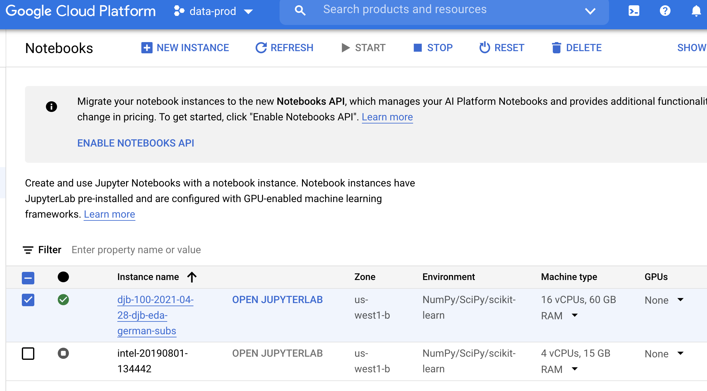
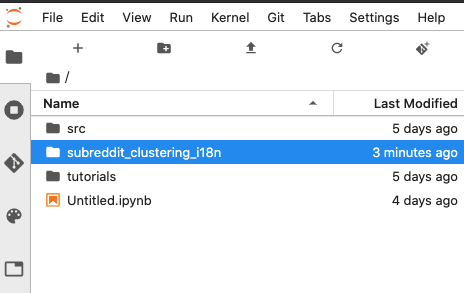
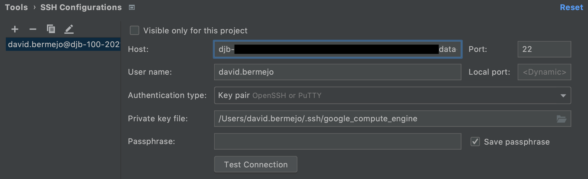
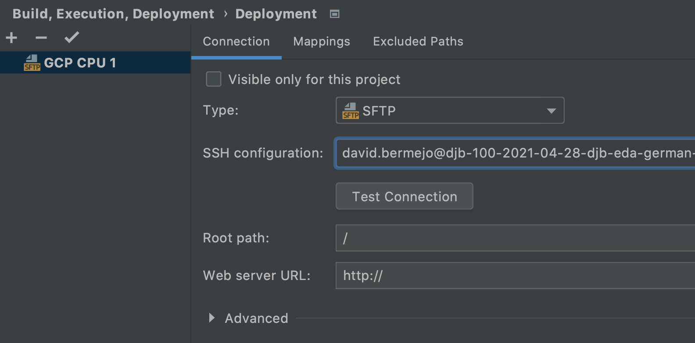
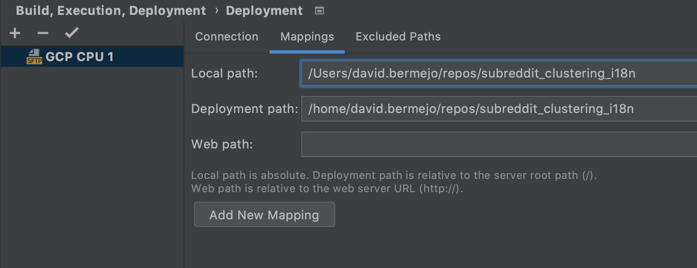
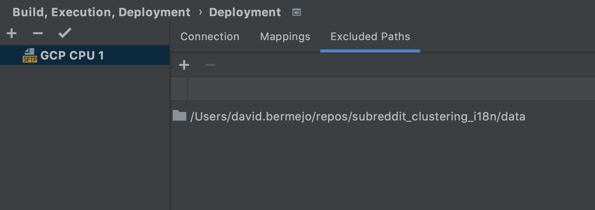
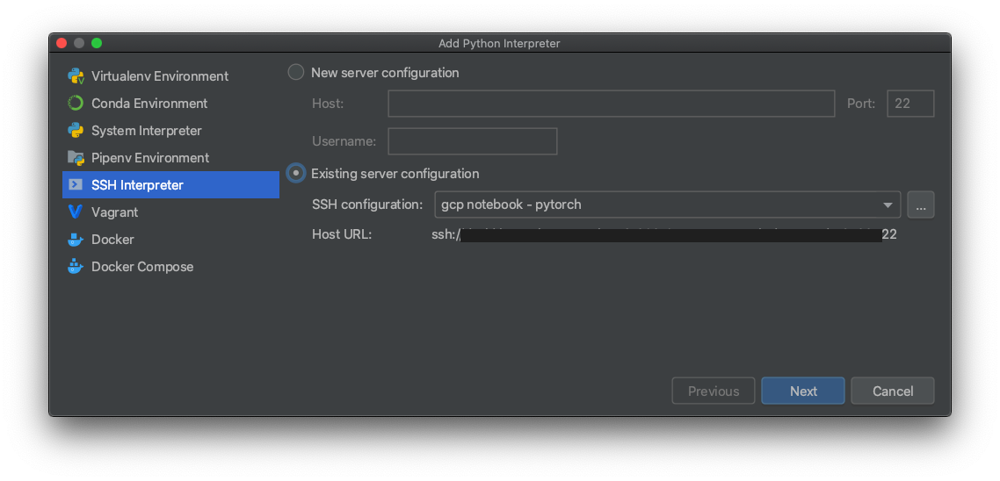
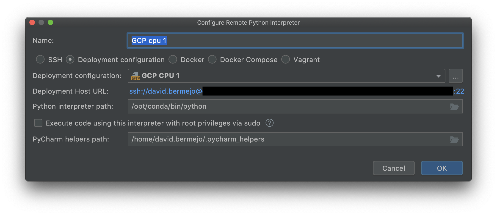

# GCP Notebooks + ssh setup
### Create a GCP Notebook
For this project I'm using GCP notebooks for R&D because they offer self-service scalability & ssh connections that make it easy to integrate with PyCharm for local development & github integration.

Here's the dashboard to access GCP instances/notebooks:
https://console.cloud.google.com/ai-platform/notebooks/list/instances?project=data-prod-165221

For v0/v1 we'll be using FastText and a CPU instance is good enough.




**TODO(djb)**: After v0 try a raw GCP machine instead. Suggested by Ugan:
- https://console.cloud.google.com/marketplace/product/nvidia-ngc-public/nvidia-gpu-cloud-pytorch-image?project=data-science-prod-218515


### Set up gcloud tools in your laptop (if you haven't set it up)
In order to authenticate & connect to a GCP notebook, we need to use the `gcloud` SDK. For the latest instructions see here: https://cloud.google.com/sdk/docs/install
- Download the installer for your OS
  - Example: for intel Mac laptops (non M1) download `macOS 64-bit (x86_64)`
- Move & unzip the file in your home directory
- Run this command to install the sdk: `./google-cloud-sdk/install.sh`
- (Optional) Delete the zipped package

### Run authentication SDK & set default project name
After gcloud sdk is installed, run this command to create authentication tokens:
<br>`gcloud auth login`

Set the default project with this command:
<br>`gcloud config set project data-prod-165221`

### Create SSH keys & refresh GCP tokens
`gcloud compute config-ssh`

This command will refresh authentication tokens & checks which virtual machines are available for you. You'll need to run it every ~8 or ~12 hours. [The documentation isn't clear on timing](https://cloud.google.com/sdk/gcloud/reference/compute/config-ssh).

The first time you run the command, it'll also create a new set of SSH keys. Note that you'll be asked to create a passphrase for additional security.

### Connect to instance from command line
Once you have the keys & tokens refreshed, you can connect to your instance using regular ssh, like this:
<br>`ssh <notebook-name>.<notebook-region>.<project-name>`

For example:
<br>`ssh djb-100-2021-04-28-djb-eda-german-subs.us-west1-b.data-prod-165221`

### What is home?
When you ssh, you will only have write access to your personal folder. When you ssh, your home will be:
<br>`/home/<gcp-user>`

In my case, it is:
<br>`/home/david.bermejo`

NOTE: When you are logged in via the JupyterLab GUI (HTTPS server), your home directory for JupyterLab will be:
<br>`/home/jupyter`


# Clone repo to JupyterLab. Use: create & edit notebooks
## Create new SSH key
Follow github's guide to create an SSH key & add it to your agent.
- https://docs.github.com/en/github/authenticating-to-github/generating-a-new-ssh-key-and-adding-it-to-the-ssh-agent

tl;dr:
0. Open a terminal
   
1. Generate new key with a passphrase
```
ssh-keygen -t ed25519 -C "your_email@example.com"

# if prompted for location, press enter to write to default
 Enter a file in which to save the key (/home/you/.ssh/id_ed25519): [Press enter]
 
> Enter passphrase (empty for no passphrase): [Type a passphrase]
> Enter same passphrase again: [Type passphrase again]
```

## Add SSH key to ssh-agent
After creating the key you'll need to 1) start the ssh-agent, 2) add your key to ssh-agent:
```
eval "$(ssh-agent -s)"

ssh-add ~/.ssh/id_ed25519
```

Note: you'll be prompted for your git passphrase.

## Add key to github
github's guide:
- https://docs.github.com/en/github/authenticating-to-github/connecting-to-github-with-ssh/adding-a-new-ssh-key-to-your-github-account

tl;dr:
shortcut for keys:
- https://github.snooguts.net/settings/keys
0. Go to reddit's enterprise github
1. Click on your user-name (top right corner) > settings
2. Click on `ssh and gpg keys`
3. Click on `New SSH key` button

On command line of your new VM:
4. Copy or open the public key for your new key. For example, open it in `nano` to copy it:
<br>```nano ~/.ssh/id_ed25519.pub```

5. Paste public key into the `Key` field in github
6. Add a `title` for the key. Example: `gcp TF machine` 


## Clone repo to JupyterLab
The default method to clone uses HTTPS, but Reddit requires ssh authentication. So you need to open a terminal and clone it like so:
`git clone git@github.snooguts.net:david-bermejo/subreddit_clustering_i18n.git`

After you clone, you can cd to the new folder with the repo & use git CLI as usual.

Note: it can be a bit confusing, but the version of the library we install won't be the same one that runs jupyter notebooks

Here's what the JupyterLab file explorer should look like after cloning the repo




# PyCharm Setup
## Add SSH connection to PyCharm
The notes below are a summary of Pycharm's detailed guides here:
<br>https://www.jetbrains.com/help/pycharm/create-ssh-configurations.html

- Open the Settings/Preferences dialog (`⌘,`)
- Go to **Tools > SSH Configurations**.
- Fill out the Host, User name, & other information to look like the screenshot below.
    - Host should be the same as what you use to connect via the command line, e.g., `djb-100-XXX-subs.us-west1-b.data-prod-165221`
- For **Authentication type** select `Key pair`
  - Note that `gcloud` will create the **Private key file** in: `~/.ssh/google_compute_engine`
  - Save the passphrase so that PyCharm can automatically upload without asking for it on each sync 




## Add deployment configuration (remote syncing)
After you've set an ssh connection, you can connect to the same host to sync changes between the two locations. You can find most of these options under the `deployment` menu:
<br>https://www.jetbrains.com/help/pycharm/creating-a-remote-server-configuration.html

- Settings ( `⌘` + `,`) > `Deployment` > Add (plus sign)
- When you use SSH, you should select the `SFTP` type.
- Set **Root path** to `/`
  - PyCharm uses relative paths later on that can be confusing
- For mappings, make sure to map local repo to remote repo location
  - Local path: `/Users/david.bermejo/repos/subreddit_clustering_i18n`
  - Deployment path: `/home/david.bermejo/repos/subreddit_clustering_i18n`
  - Deployment path 2: `/home/jupyter/subreddit_clustering_i18n` (this is where jupyter notebooks run)
- Exclude `/data` subfolder unless needed
  - Exclude path (data folder): `/Users/david.bermejo/repos/subreddit_clustering_i18n/data` 







### Upload & sync
The first time you create a deployment config, you might need to manually push all your local code to the new remote. One way to do it is to:
- `Right click` on the top-level (root) folder of your path
- \> `Deployment` > `Upload to <deployment>`


Other options: I prefer to sync only saved files, but you can change as you like.
- Go to: **`Tools` > `Deployment` > `Options`**


## Add remote interpreter to PyCharm
After you've set the remote connection you can use the remote interpreter. The notes below are a summary of Pycharm's detailed guides here:
<br>https://www.jetbrains.com/help/pycharm/configuring-remote-interpreters-via-ssh.html#ssh
- Settings ( `⌘` + `,`) > `Python Interpreter` > `Add...` (gear icon)
- Python interpreter path:
<br>`/opt/conda/bin/python`






# Install our module in `editable` mode
After you have the code for this project on your remote, you can install it as a module.

Editable makes it easy to continue editing your module and use the updated code without having to re-install it. This can speed up development when you pair it with jupyter's magic to automatically refresh edited code without having to re-import the package.

To install the repo as a package as `--editable` in GCP, first assume sudo for your gcp user. Then install the code from where you stored the code synced to PyCharm.

NOTE: you might need to install it with a `--user` flag in case some of the installed packages create conflicts with native packages
```
sudo su - david.bermejo

pip install -e /home/david.bermejo/repos/subreddit_clustering_i18n/

# or if you're installing a superset of requirements add `[<extra_name>]`
pip install -e /home/david.bermejo/repos/subreddit_clustering_i18n/[pytorch]

# for tensorflow VM/image I tried the --user tag because I was getting
#  access errors. But that fails because subclu wouldn't be installed
#  for the jupyter user that's the default for jupyterlab server
pip install -e /home/david.bermejo/repos/subreddit_clustering_i18n/ --user
```

In jupyter, you can add this magic at the beginning of a notebook to reload edited code:
```
%load_ext autoreload
%autoreload 2
```


# Running mlflow server on GCP

Run this command in GCP Notebok/VM:
```
mlflow server --backend-store-uri sqlite:///mlflow/mlruns.db --default-artifact-root gs://i18n-subreddit-clustering/mlflow/mlruns
```

Need to tunnel into it from local using custom ssh function:
```
dj_ssh_mlflow cpu
```

